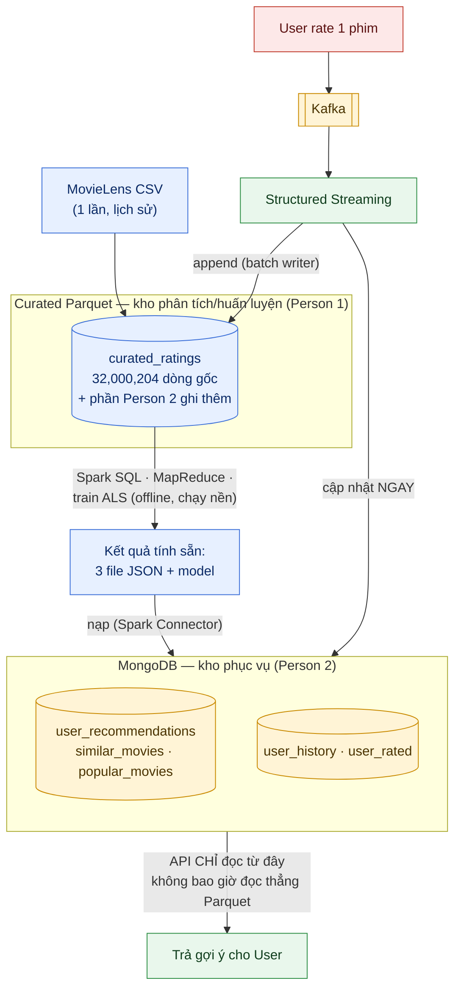
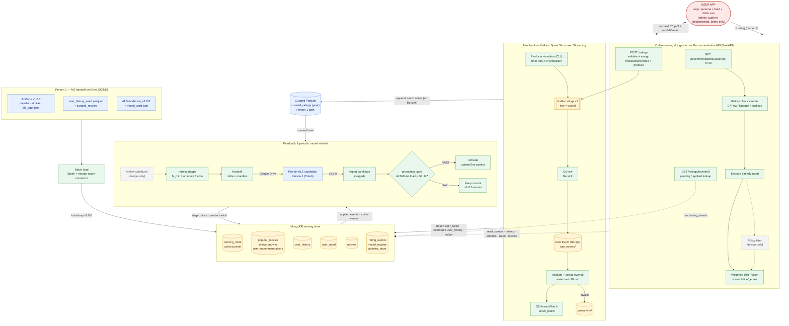
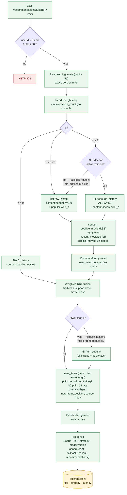
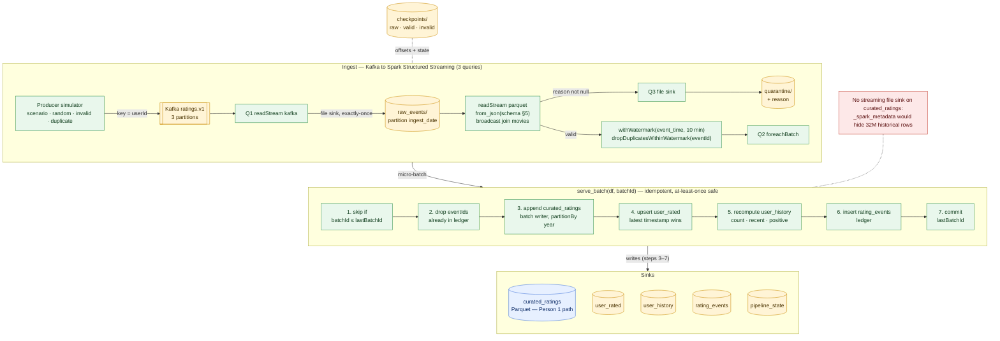
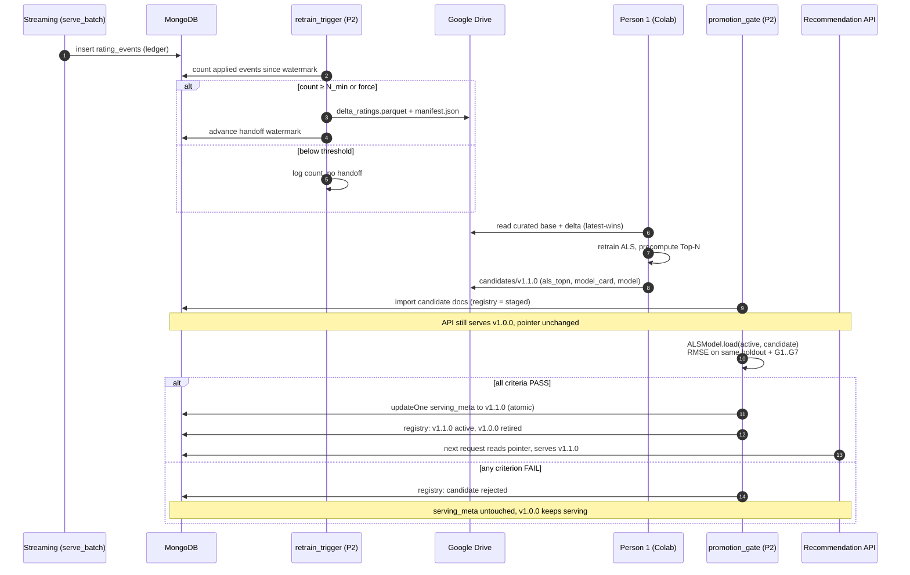
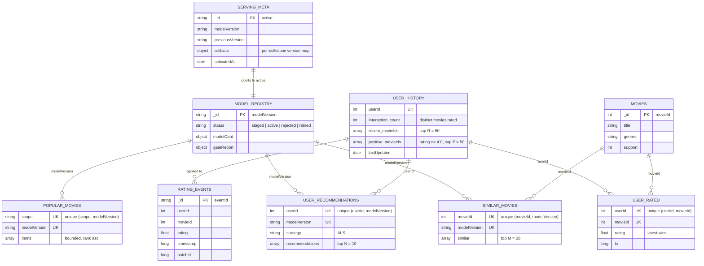
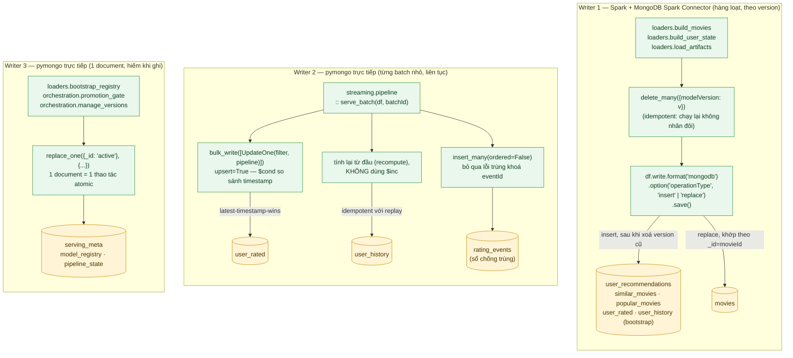

# Kiến trúc Serving, Streaming & Model Refresh (Person 2)

> Nguồn thiết kế: `openspec/changes/person2-serving-streaming-integration/design.md` (D-1 … D-15).
> Contract dữ liệu: `contracts/CONTRACTS.md`. Chi tiết triển khai production: `docs/DEPLOYMENT_DESIGN.md`.
>
> **Cập nhật 2026-09-27**: mọi khối màu xanh lá dưới đây đã **Implemented** — chạy thật trên
> Docker Compose (`docker/docker-compose.yml`), verify bằng dữ liệu M2 thật (200,948 user,
> 32,000,204 rating). Bằng chứng: `evidence/p2_*`, `openspec/changes/person2-serving-streaming-integration/tasks.md`.

**Chú thích màu (dùng chung cho mọi sơ đồ):**

| Màu | Ý nghĩa | Trạng thái |
|---|---|---|
| Xanh dương | Person 1: offline modeling | **Implemented** — xong ở M2 |
| Xanh lá | Person 2: serving/streaming/orchestration | **Implemented** — chạy thật, có evidence (xem ghi chú trên) |
| Vàng | Kho dữ liệu: MongoDB, Kafka, Parquet | **Implemented** |
| Xám, viền đứt | Design-only | **Proposed** — chưa triển khai trong phạm vi course (Policy/Eligibility Filter — thiếu dữ liệu tuổi/certification; Airflow scheduler — dùng CLI `--force`/cron thủ công thay thế; cluster/cloud thật — xem `docs/DEPLOYMENT_DESIGN.md` §2) |

---

## 0. Vì sao 2 kho dữ liệu: Curated Parquet vs MongoDB

> Trả lời trực tiếp câu hỏi review: *"Architecture chưa mô tả rõ cách data được lưu
> xuống DB như thế nào?"* — trước khi đi vào chi tiết từng sơ đồ, cần hiểu **vì sao
> có 2 kho** và **kho nào chứa gì**. `docs/ARCH.txt` (kiến trúc gốc) đã nêu nguyên tắc
> này: *"MongoDB là Serving Store, không phải training store. Curated Parquet là
> nguồn phân tích/huấn luyện; MongoDB tối ưu cho read path theo userId/movieId."*

Hai kho phục vụ hai cách đọc dữ liệu khác nhau — dùng chung 1 kho cho cả 2 việc sẽ
chậm ở ít nhất 1 phía:

| | Curated Parquet | MongoDB |
|---|---|---|
| Mục đích | Phân tích + huấn luyện (Spark SQL, MapReduce, train ALS) | Phục vụ trực tiếp (API trả lời user) |
| Cách đọc điển hình | Quét **toàn bộ** dữ liệu (32,000,204 dòng) | Tra **đúng 1 bản ghi** theo `userId`/`movieId` |
| Tốc độ chấp nhận được | Vài giây → vài phút (chạy nền, không ai chờ) | Vài mili-giây (user đang chờ) |
| Ai ghi | Person 1 (ETL gốc) + Person 2 (streaming ghi thêm) | Chỉ Person 2 |

**Điểm dễ hiểu nhầm nhất**: khi user rate 1 phim, dữ liệu đi vào **cả 2 kho cùng
lúc** nhưng với 2 tác dụng khác nhau:

1. **Ghi vào MongoDB** (`user_history`, `user_rated`) → có tác dụng **ngay lập
   tức**. Gọi lại API liền sau khi rate là thấy thay đổi (đổi tier, loại phim vừa
   xem khỏi gợi ý).
2. **Ghi thêm vào Curated Parquet** (`curated_ratings`) → **không** có tác dụng
   ngay. Chỉ nằm chờ tới khi Person 2 đóng gói đủ dữ liệu mới gửi cho Person 1
   train lại ALS; gợi ý ALS chỉ đổi sau khi model mới được huấn luyện và duyệt
   qua promotion gate.

Đây chính là nguyên tắc `docs/ARCH.txt` đã ghi: *"Streaming ingestion và ALS
retraining là hai việc khác nhau. Rating mới có thể xuất hiện trong User History
ngay, nhưng chỉ ảnh hưởng latent factors của ALS sau lần Scheduled Retraining kế
tiếp."* MongoDB phản ứng tức thì với hành vi user; model ALS thì học theo lịch,
không học theo từng lần rate.

Chi tiết **MongoDB ghi bằng cơ chế nào** (Spark Connector vs pymongo, insert vs
upsert) xem mục 6 bên dưới.

---

## 1. Tổng thể

- **Đường online** (User → API → Mongo): chỉ **đọc** artifact đã precompute, không chạy Spark.
- **Đường ghi rating** (User → API `POST /ratings` → Kafka → Streaming): hộp USER APP là **trang người dùng `/app`** (persona demo, không xác thực, `demo-user-app-personas`) — bấm ⭐ trên trình duyệt đi qua đúng API; trang `/admin` (trang `/demo` cũ, `add-demo-web-client`) là phía quản trị. Cả hai, không đọc/ghi thẳng Mongo hay Kafka. API chỉ xác nhận đã vào Kafka (202), **không** đợi streaming áp dụng — `GET /ratings/{eventId}` cho biết `pending` hay `applied`. CLI `streaming.producer` vẫn là một producer khác, song song, dùng cho kịch bản test không qua API.
- **Đường refresh**: tích luỹ event, bàn giao cho Person 1 retrain, qua gate, rồi đổi con trỏ `serving_meta`.

---

## 2. Luồng request online (Layer 2B)

- 46,340 user cold-start (có ≥ 20 ratings nhưng không có doc ALS) đi nhánh `als_artifact_missing` và nhận gợi ý Content, không rơi thẳng về Popularity.
- Exclusion dùng `user_rated` (tập phim đã rate đầy đủ), nên không bỏ sót phim user đã rate từ lâu.
- **Phim mới (`new_items`, change `demo-use-case-scenarios`)**: `similar_movies` được tính sẵn nên phim thêm sau không nằm trong danh sách của phim nào, đường content không bao giờ đưa nó lên. Bước `NEWI` ghép phim demo (id ≥ 9,000,000, `addedAt` trong `window_days`) với hồ sơ thể loại tính từ cùng danh sách seed của nguồn content, rồi **chèn vào một vị trí dành riêng** (mặc định hạng 3, 1 phim) thay vì cộng điểm RRF: với trọng số vừa phải phim mới không thắng nổi doc ALS 10 phim, còn trọng số lớn thì đè lên phim ALS tốt nhất. Tier `0_history` không nhận phim mới. Tắt bằng `new_items.enabled: false` thì kết quả y hệt trước đây.

---

## 3. Streaming pipeline (Layer 1: streaming path)

- **Idempotency:** bước 4–5 tính lại trạng thái (count, move-to-front, max), không dùng `$inc`. Ledger được ghi **sau** khi đã áp dụng, nên replay một batch không làm lệch `interaction_count`.
- **Parquet bị append trùng khi batch chạy lại:** xử lý bằng quy tắc latest-wins theo `(userId, movieId)` khi đọc để retrain. Quy tắc này cần Person 1 xác nhận (D4).

---

## 4. Vòng đời model: retrain và promotion (Layer 3)

- Person 1 train. Person 2 lo trigger, bàn giao, gate và activate/rollback (tracker 6.1/6.2).
- Gate **tính lại RMSE độc lập** bằng `ALSModel.load()` thay vì tin số trong `model_card.json`.

---

## 5. Data model MongoDB (report §10)

- **Embed:** các danh sách Top-N / similar / popular bị chặn độ dài (10 / 20 / 100), nên chỉ cần 1 lần đọc.
- **Reference:** `user_rated` lưu mỗi cặp (user, movie) là 1 document. Tập phim đã rate không bị chặn (user nhiều nhất có 33,332 ratings); query `$in` trên index `(userId, movieId)` là covered query.
- **Version hoá:** mọi artifact mang `modelVersion`. Chỉ document `serving_meta` quyết định version nào đang được phục vụ, và đổi version là cập nhật 1 document, nên là thao tác atomic.

---

## 6. Cơ chế ghi dữ liệu vào MongoDB — "bằng cách nào", không chỉ "cái gì"

> Các sơ đồ ở §1–§4 cho thấy dữ liệu nào chảy vào Mongo. Mục này trả lời câu hỏi
> hay bị hỏi lại: **công cụ nào thực hiện việc ghi, và ghi theo kiểu gì**. Có
> **3 "người ghi" khác nhau**, cố ý tách riêng vì tần suất và khối lượng dữ liệu
> rất khác nhau — dùng chung 1 cách ghi cho cả 3 sẽ sai ở ít nhất 1 trường hợp
> (xem lý do từng nhánh bên dưới).

| Writer | Vì sao KHÔNG dùng cách ghi của 2 nhánh còn lại |
|---|---|
| 1. Spark Connector | Ghi bằng `pymongo` từng document một cho 154,608 document `als_topn` sẽ chậm hơn nhiều lần so với Spark ghi song song qua nhiều executor — phù hợp cho khối lượng lớn, chạy 1 lần |
| 2. `pymongo` (streaming) | Cần `upsert` có điều kiện (chỉ ghi đè nếu bản mới hơn) và tính lại `user_history` mỗi lần — Spark Connector chỉ hỗ trợ `insert`/`replace` đơn giản, không biểu diễn được logic "so sánh rồi mới quyết định ghi" này |
| 3. `pymongo` (con trỏ version) | Chỉ 1 document, tần suất cực thấp (vài lần/ngày) — dùng Spark cho việc này là phí tài nguyên (phải khởi động cả cluster Spark chỉ để ghi 1 dòng) |

**Vì sao writer 2 "tính lại toàn bộ" thay vì `$inc`/cộng dồn?** Kafka + Structured
Streaming chỉ đảm bảo **at-least-once** (một batch có thể được xử lý lại nếu job
crash giữa chừng) — nếu dùng `$inc` thì crash 1 lần là `interaction_count` bị
cộng sai. Tính lại từ `user_rated` (đã upsert theo `(userId, movieId)`) đảm bảo
xử lý lại 5 lần hay 1 lần đều ra kết quả giống hệt nhau — **đã verify thật**:
gửi trùng 1 sự kiện 3 lần, `interaction_count` không đổi (`evidence/p2_5_2_streaming.txt`).

**Vì sao writer 1 xoá rồi ghi lại thay vì "chỉ thêm dòng mới"?** Vì mỗi lần nạp
artifact là nạp **một version hoàn chỉnh mới** (ví dụ `als_topn.json` của
`v1.0.0`), không phải nạp thêm — xoá sạch version cũ trước khi ghi đảm bảo chạy
lại script này 2 lần cho ra đúng 1 bộ dữ liệu, không có document rác từ lần chạy
trước còn sót lại.
